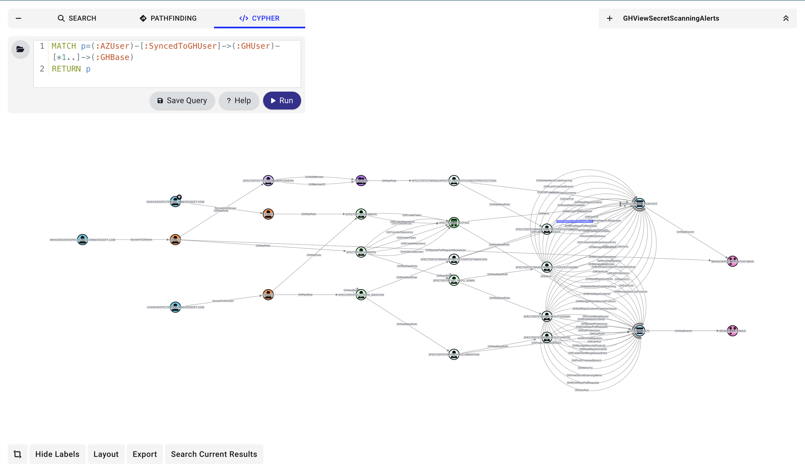
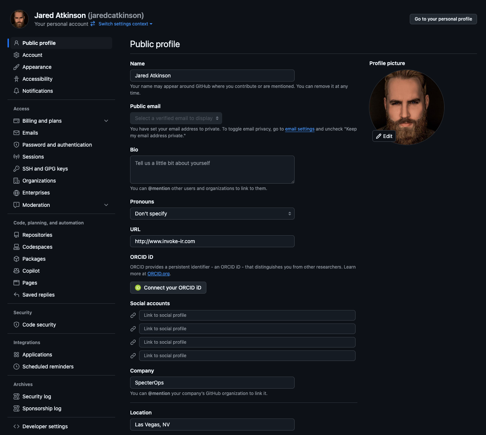
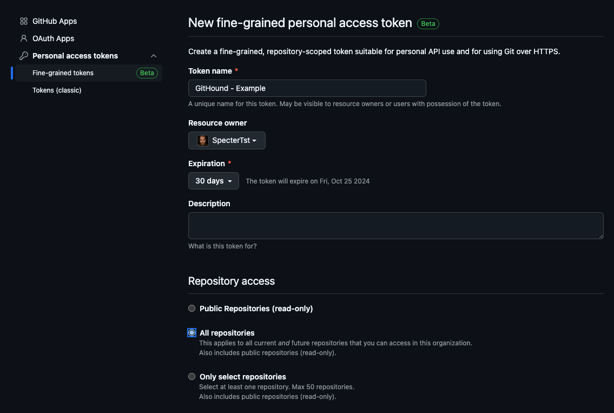
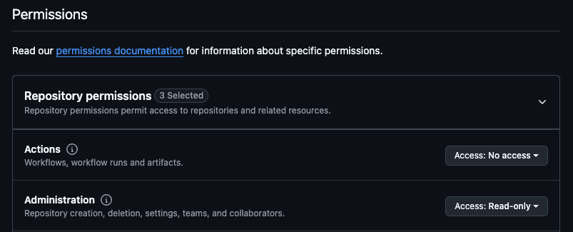
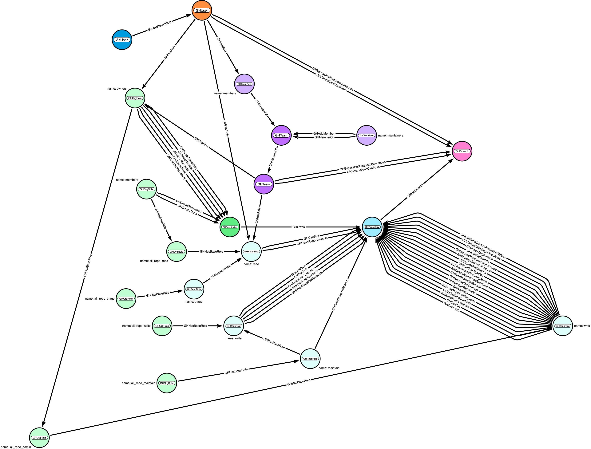
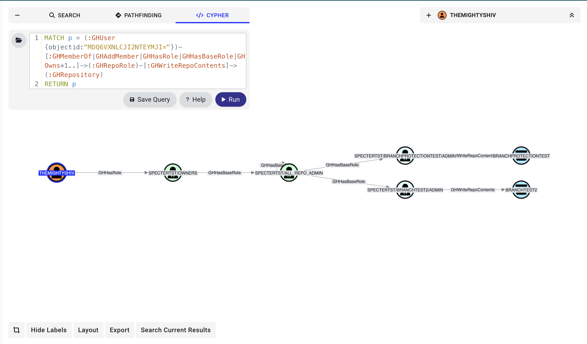
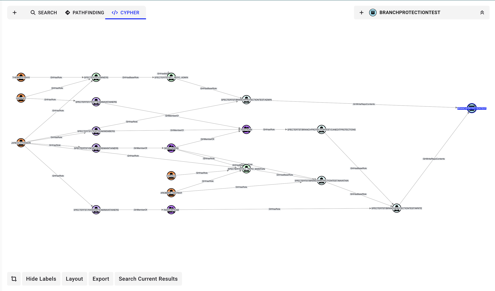
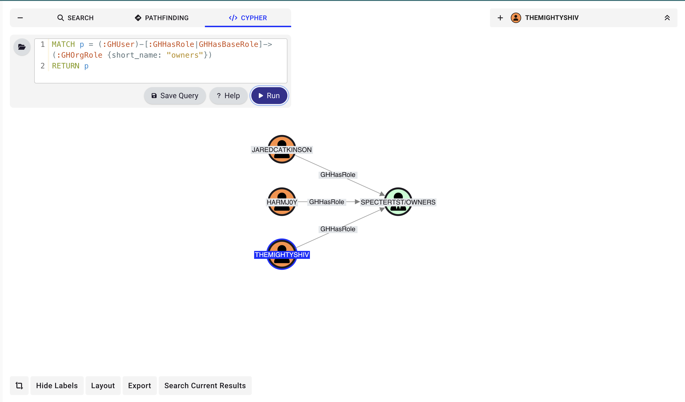
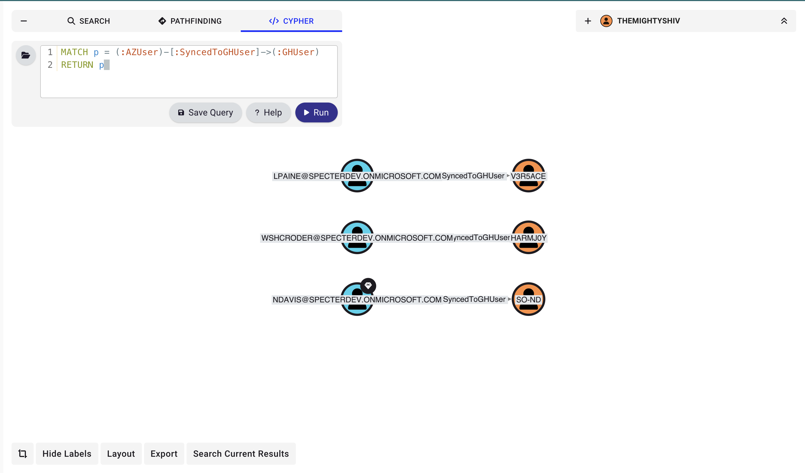

# GitHound



## Overview

**GitHound** is a BloodHound OpenGraph collector for GitHub, designed to map your organization’s structure and permissions into a navigable attack‑path graph. It:

- **Models Key GitHub Entities**  
  - **GHOrganization**: Your GitHub org metadata  
  - **GHUser**: Individual user accounts in the org  
  - **GHTeam**: Teams that group users for shared access  
  - **GHRepository**: Repositories within the org  
  - **GHBranch**: Named branches in each repo  
  - **GHOrgRole**, **GHTeamRole**, **GHRepoRole**: Org‑, team‑, and repo‑level roles/permissions  

- **Visualize & Analyze in BloodHound**  
  - **Access Audits**: See at a glance who has admin/write/read on repos and branches  
  - **Compliance Checks**: Validate least‑privilege across teams and repos  
  - **Incident Response**: Trace privilege escalations and group memberships  

With GitHound, you get a clear, interactive graph of your GitHub permissions landscape—perfect for security reviews, compliance audits, and rapid incident investigations.  

## Collector Setup & Usage

### Creating a Personal Access Token Overview

Settings -> Developer settings -> Personal access tokens -> Fine-grained tokens -> Generate new token

* Repository access -> All repositories

* "Administrator" repository permissions (read)
* "Contents" repository permissions (read)
* "Metadata" repository permissions (read)

* "Custom organization roles" organization permissions (read)
* "Custom repository roles" organization permissions (read)
* "Members" organization permissions (read)

### Generate Fine-grained Personal Access Token (Detailed)

This walkthrough is for administrators to create the Fine-grained Personal Access Token that is necessary to collect the data that is necessary for the GitHub based BloodHound Graph. These steps should be followed in the context of an organization administrator in order to ensure the resulting PAT will have full access to Repositories, Users, and Teams in the GitHub Organization.

#### Generate Token

To generate a personal access token browse to your user settings as shown in the image below:


In the settings menu, scroll to the bottom where you will see the "Developer settings" menu option. Click it.



GitHub offers many options for programmatic access. GitHound, our collector, is built to work with Fine-grained Personal Access Tokens, so click on that menu item.


After reaching the Fine-grained Personal Access Token page, you can click on the "Generate new token" button in the top right corner.


#### Token Settings

Fine-grained Personal Access Tokens offer administrators the ability to specifically control what resources the PAT will have access to.

It is possible to limit the set of repositories that a Fine-grained PAT can interact with. GitHound requires access to all repositories, so we will select the "All repositories" radio button.



Next, we will define the specific repository and organization permissions that GitHound requires. GitHound is a read-only tool, so we will make sure to specify read-only access for each option as shown in the image below:



The following permissions are required:

| Target       | Permission                | Access    |
|--------------|---------------------------|-----------|
| Repository   | Administrator             | Read-only |
| Repository   | Contents                  | Read-only |
| Repository   | Metadata                  | Read-only |
| Organization | Administrator             | Read-only |
| Organization | Custom organization roles | Read-only |
| Organization | Custom repository roles   | Read-only |
| Organization | Members                   | Read-only |

#### Save Personal Access Token

Once the PAT is created, GitHub will present it to you as shown below. You must save this value (preferably in a password manager) at this point as you will not be able to recover it in the future.


### Running the Collection

1. Open a PowerShell terminal
2. Load `github.ps1` in your current PowerShell session:

 ```powershell
  . ./github.ps1
 ```

3. Create a GitHub Session using your Personal Access Token.

```powershell
$session = New-GitHubSession -OrganizationName <Name of your Organization> -Token (Get-Clipboard)
```

Note: You must specify the name of your GitHub organziation. For example, this repository is part of the `SpecterOps` organization, so I would specify `SpecterOps` as the argument for the OrganizationName parameter. Additionally, you must specify your Personal Access Token. I find that it is easiest to paste it directly from the clipboard as this is where it will be after you create it or if you save it in a password manager.

4.  Run the collection on the specified organization:

```powershell
Invoke-GitHound -Session $session
```

This will output the payload to the current working directory as `githound_<your_org_identifier>.json`.

5. Upload the payload via the Ingest File page in BloodHound or via the API.

### Sample

If you do not have a GitHub Enterprise environment or if you want to test out GitHound before collecting from your own production environment, we've included a sample data set at `./samples/example.json`.

## Schema



### Nodes

Nodes correspond to each object type.

| Node                                                                     | Description                                                                                    | Icon        | Color   |
|--------------------------------------------------------------------------|------------------------------------------------------------------------------------------------|-------------|---------|
|  GHOrganization | A GitHub Organization—top‑level container for repositories, teams, & settings.               | building    | #5FED83 |
|  GHUser                 | An individual GitHub user account.                                                             | user        | #FF8E40 |
|  GHTeam                 | A team within an organization, grouping users for shared access and collaboration.             | user-group  | #C06EFF |
|  GHRepository     | A code repository in an organization (or user account), containing files, issues, etc.         | box-archive | #9EECFF |
|  GHBranch             | A named reference in a repository (e.g. `main`, `develop`) representing a line of development. | code-branch | #FF80D2 |
|  GHOrgRole           | The role a user has at the organization level (e.g. `admin`, `member`).                        | user-tie    | #BFFFD1 |
|  GHTeamRole         | The role a user has within a team (e.g. `maintainer`, `member`).                               | user-tie    | #D0B0FF |
|  GHRepoRole         | The permission granted to a user or team on a repository (e.g. `admin`, `write`, `read`).      | user-tie    | #DEFEFA |
|  GHSecretScanningAlert | A component of GitHub Advanced Security to notify organizations when a secret is accidentally included in a repo's contents | key | #3C7A6E |

### Edges

| Edge Type                         | Source           | Target                  | Travesable | Custom |
|-----------------------------------|------------------|-------------------------|------------|--------|
| `GHContains`                      | `GHOrganization` | `GHOrgRole`             | n          | n/a    |
| `GHContains`                      | `GHOrganization` | `GHRepoRole`            | n          | n/a    |
| `GHContains`                      | `GHOrganization` | `GHRepository`          | n          | n/a    |
| `GHContains`                      | `GHOrganization` | `GHTeamRole`            | n          | n/a    |
| `GHContains`                      | `GHOrganization` | `GHTeam`                | n          | n/a    |
| `GHContains`                      | `GHOrganization` | `GHUser`                | n          | n/a    |
| `OPContains`                      | `GHRepository`   | `GHBranch`              | n          | n/a    |
| `GHHasRole`                       | `GHUser`         | `GHOrgRole`             | y          | n/a    |
| `GHHasRole`                       | `GHUser`         | `GHRepoRole`            | y          | n/a    |
| `GHHasRole`                       | `GHUser`         | `GHTeamRole`            | y          | n/a    |
| `GHMemberOf`                      | `GHTeamRole`     | `GHTeam`                | y          | n/a    |
| `GHMemberOf`                      | `GHTeam`         | `GHTeam`                | y          | n/a    |
| `GHAddMember`                     | `GHTeamRole`     | `GHTeam`                | y          | n/a    |
| `GHCreateRepository`              | `GHOrgRole`      | `GHOrganization`        | n          | n/a    |
| `GHInviteMember`                  | `GHOrgRole`      | `GHOrganization`        | n          | n/a    |
| `GHAddCollaborator`               | `GHOrgRole`      | `GHOrganization`        | n          | n/a    |
| `GHCreateTeam`                    | `GHOrgRole`      | `GHOrganization`        | n          | n/a    |
| `GHTransferRepository`            | `GHOrgRole`      | `GHOrganization`        | n          | n/a    |
| `GHOwns`                          | `GHOrganization` | `GHRepository`          | y          | n/a    |
| `GHBypassPullRequestAllowances`   | `GHTeam`         | `GHBranch`              | n          | n/a    |
| `GHBypassPullRequestAllowances`   | `GHUser`         | `GHBranch`              | n          | n/a    |
| `GHRestrictionsCanPush`           | `GHTeam`         | `GHBranch`              | n          | n/a    |
| `GHRestrictionsCanPush`           | `GHUser`         | `GHBranch`              | n          | n/a    |
| `GHHasBranch`                     | `GHRepository`   | `GHBranch`              | n          | n/a    |
| `GHHasSecretScanningAlert`        | `GHRepository`   | `GHSecretScanningAlert` | n          | n/a    |
| `GHHasBaseRole`                   | `GHOrgRole`      | `GHOrgRole`             | y          | n/a    |
| `GHHasBaseRole`                   | `GHOrgRole`      | `GHRepoRole`            | y          | n/a    |
| `GHHasBaseRole`                   | `GHRepoRole`     | `GHRepoRole`            | y          | n/a    |
| `GHCanPull`                       | `GHRepoRole`     | `GHRepository`          | y          | n/a    |
| `GHReadRepoContents`              | `GHRepoRole`     | `GHRepository`          | y          | n      |
| `GHCanPush`                       | `GHRepoRole`     | `GHRepository`          | n          | n      |
| `GHWriteRepoContents`             | `GHRepoRole`     | `GHRepository`          | n          | n      |
| `GHWriteRepoPullRequests`         | `GHRepoRole`     | `GHRepository`          | n          | n      |
| `GHAdminTo`                       | `GHRepoRole`     | `GHRepository`          | n          | n      |
| `GHManageWebhooks`                | `GHRepoRole`     | `GHRepository`          | n          | y      |
| `GHManageDeployKeys`              | `GHRepoRole`     | `GHRepository`          | n          | y      |
| `GHPushProtectedBranch`           | `GHRepoRole`     | `GHRepository`          | n          | y      |
| `GHDeleteAlertsCodeScanning`      | `GHRepoRole`     | `GHRepository`          | n          | y      |
| `GHViewSecretScanningAlerts`      | `GHRepoRole`     | `GHRepository`          | n          | y      |
| `GHRunOrgMigration`               | `GHRepoRole`     | `GHRepository`          | n          | n      |
| `GHBypassProtections`             | `GHRepoRole`     | `GHRepository`          | n          | y      |
| `GHManageSecurityProducts`        | `GHRepoRole`     | `GHRepository`          | n          | n      |
| `GHManageRepoSecurityProducts`    | `GHRepoRole`     | `GHRepository`          | n          | n      |
| `GHEditProtections`               | `GHRepoRole`     | `GHRepository`          | n          | y      |
| `GHJumpMergeQueue`                | `GHRepoRole`     | `GHRepository`          | n          | y      |
| `GHCreateSoloMergeQueue`          | `GHRepoRole`     | `GHRepository`          | n          | y      |
| `GHEditRepoCustomPropertiesValue` | `GHRepoRole`     | `GHRepository`          | n          | y      |

## Usage Examples

### What Repos does a User have Write Access to?

Find the object identifier for your target user:

```cypher
MATCH (n:GHUser)
RETURN n
```

HINT: Select Table Layout

https://github.com/user-attachments/assets/1ddfd075-2a15-4aa9-bad7-74c43e6c82d6

Replace the `<object_id>` value in the subsequent query with the user's object identifier:

```cypher
MATCH p = (:GHUser {objectid:"<object_id>"})-[:GHMemberOf|GHAddMember|GHHasRole|GHHasBaseRole|GHOwns*1..]->(:GHRepoRole)-[:GHWriteRepoContents]->(:GHRepository)
RETURN p
```



### Who has Write Access to a Repo?

Obtain the object identifier for your target repository:

```cypher
MATCH (n:GHRepository)
RETURN n
```

Take the object identifier for your target repository and replace the `<object_id>` value in the subsequent query with it:

```cypher
MATCH p = (:GHUser)-[:GHMemberOf|GHHasRole|GHHasBaseRole|GHOwns|GHAddMember*1..]->(:GHRepoRole)-[:GHWriteRepoContents]->(:GHRepository {objectid:"<object_id>"})
RETURN p
```



### Members of the Organization Admins (Domain Admin equivalent)?

```cypher
MATCH p = (:GHUser)-[:GHHasRole|GHHasBaseRole]->(:GHOrgRole {short_name: "owners"})
RETURN p
```



### Users that are managed via SSO (Entra-only)

```cypher
MATCH p = (:AZUser)-[:SyncedToGHUser]->(:GHUser)
RETURN p
```



## Contributing

We welcome and appreciate your contributions! To make the process smooth and efficient, please follow these steps:

1. **Discuss Your Idea**  
   - If you’ve found a bug or want to propose a new feature, please start by opening an issue in this repo. Describe the problem or enhancement clearly so we can discuss the best approach.

2. **Fork & Create a Branch**  
   - Fork this repository to your own account.  
   - Create a topic branch for your work:
     ```bash
     git checkout -b feat/my-new-feature
     ```

3. **Implement & Test**  
   - Follow the existing style and patterns in the repo.  
   - Add or update any tests/examples to cover your changes.  
   - Verify your code runs as expected:
     ```bash
     # e.g. dot-source the collector and run it, or load the model.json in BloodHound
     ```

4. **Submit a Pull Request**  
   - Push your branch to your fork:
     ```bash
     git push origin feat/my-new-feature
     ```  
   - Open a Pull Request against the `main` branch of this repository.  
   - In your PR description, please include:
     - **What** you’ve changed and **why**.  
     - **How** to reproduce/test your changes.

5. **Review & Merge**  
   - I’ll review your PR, give feedback if needed, and merge once everything checks out.  
   - For larger or more complex changes, review may take a little longer—thanks in advance for your patience!

Thank you for helping improve this extension! 🎉  

## Licensing

```
Copyright 2025 Jared Atkinson

Licensed under the Apache License, Version 2.0
you may not use this file except in compliance with the License.
You may obtain a copy of the License at

    http://www.apache.org/licenses/LICENSE-2.0

Unless required by applicable law or agreed to in writing, software
distributed under the License is distributed on an "AS IS" BASIS,
WITHOUT WARRANTIES OR CONDITIONS OF ANY KIND, either express or implied.
See the License for the specific language governing permissions and
limitations under the License.
```

Unless otherwise annotated by a lower-level LICENSE file or license header, all files in this repository are released
under the `Apache-2.0` license. A full copy of the license may be found in the top-level [LICENSE](LICENSE) file.
